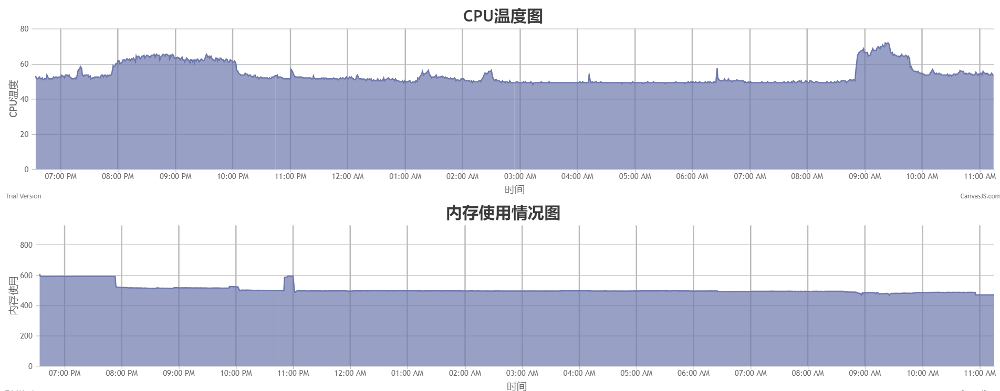

# 树莓派系统监控--CPU温度监控和内存使用情况监控
## 系列文章：
*    文章1：[打造自己的树莓派监控系统1--CPU监控-matplotlib显示数据](https://blog.csdn.net/zhangpeterx/article/details/84071442)      
*    文章2：[打造自己的树莓派监控系统2--内存监控-matplotlib显示数据](https://blog.csdn.net/zhangpeterx/article/details/84288281)       
*    文章3：[打造自己的树莓派监控系统3--canvas.js绘制数据](https://blog.csdn.net/zhangpeterx/article/details/84819958)         
## 准备
需要安装Python3,Flask,git,screen：
```bash
apt install python3 python3-pip python3-flask screen git
```
## 运行
运行如下命令：
```bash
git clone https://github.com/zhang0peter/raspberry-pi-monitor.git
cd raspberry-pi-monitor/
screen -S raspberry-pi-monitor
bash main.sh
```
然后在浏览器中打开[http://127.0.0.1:4000/](http://127.0.0.1:4000/)即可看到树莓派的监控：
效果如下：    
       
demo见[demo.html(?加载有点慢)](http://htmlpreview.github.io/?https://github.com/zhang0peter/raspberry-pi-monitor/blob/master/demo.html)      


